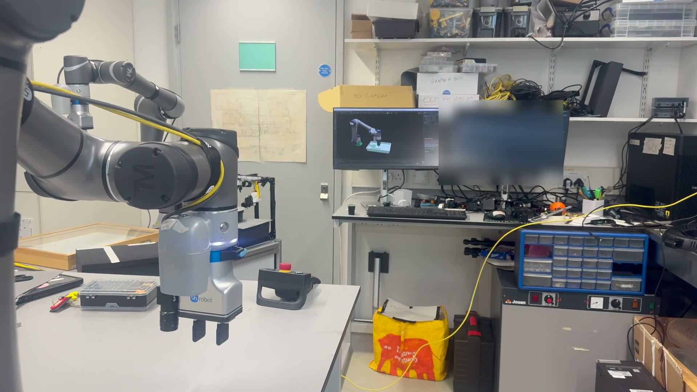
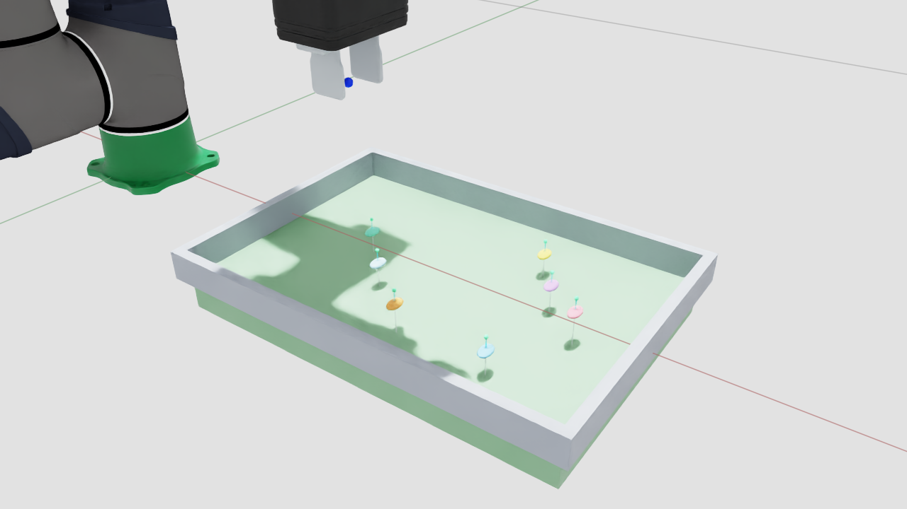

# Techman Isaac Jazzy Live Twin

[](https://github.com/JackDanHollister/techman-isaac-jazzy-live-twin/actions/workflows/tests.yml)
[](https://www.python.org/)
[](https://docs.ros.org/en/jazzy/)
[](LICENSE)

A safety-conscious ROS 2 Jazzy reference implementation for running a live
kinematic digital twin of a Techman TM5S robot in NVIDIA Isaac Sim and
orchestrating guarded hardware-in-the-loop demonstrations.

This repository grew from a seven-specimen pin-verticalisation workflow. It now
contains the reusable connection, live-joint mirroring, Isaac timeline
orchestration, Techman/MoveIt execution guards, and OnRobot 2FG7 integration
used by that demonstration.

> **Status: validated reference, experimental physical execution.** Preview and
> read-only mirroring are the recommended starting points. The physical path is
> a system-specific empty-cell air replay, not a general robot-control product
> or a safety system.

[](docs/media/watson_live_twin_demo.mp4)

*Click to play: Watson runs the guarded seven-pin air replay while Isaac mirrors
the measured joints live (17 s).*



*The bundled offline preview scene — runs with no robot and no ROS.*

## What it does

| Mode | Robot contact | Capability | Status |
|---|---:|---|---|
| Preview | None | Plays the complete seven-specimen workflow in Isaac | Validated |
| Live twin | Read-only | Mirrors measured Techman joint states into paused Isaac physics | Validated |
| Dry run | Read-only | Runs live gates and builds all trajectory messages without submitting goals | Validated |
| Execute | Yes | Isaac Play launches a guarded Techman + 2FG7 air replay | Experimental |

The arm view is driven by measured `/watson/joint_states`, not by a second
independent animation. Gripper and specimen visuals follow ordered completion
events from the guarded runner.

## Engineering highlights

- **Measured-state twin:** the rendered arm follows validated robot feedback;
  it is not a parallel animation that can silently drift from the hardware.
- **Separated authority:** Isaac presents and orchestrates, while one guarded
  external process owns every physical command path.
- **Fail-closed execution:** network route, ROS graph ownership, controller
  state, start pose, tool profile, trajectory hashes, motion envelopes, and
  stop recovery are checked before or during execution.
- **Reproducible evidence:** a sanitised reference bundle and offline regression
  suite preserve the exact seven-specimen demonstration without requiring a
  connected robot.

For a first look, run the [offline preview](#1-offline-preview). To understand
the safety boundary, start with [Architecture](docs/architecture.md) and
[Safety](docs/safety.md).

## Architecture

```text
/watson/joint_states
        |
        v
stale-aware validator ---------> paused Isaac articulation
                                  arm: measured joints
                                  fingers/specimens: ordered events

Isaac toolbar Play
        |
        v
one-shot HIL coordinator
        |
        v
guarded wrapper ---> MoveIt / tm_driver ---> Techman TM5S
        |
        +----------> OnRobot Compute Box / 2FG7
        |
        +----------> ordered events --------> Isaac presentation
```

Isaac does not create a robot command publisher, service client, or action
client. The guarded external wrapper is the sole physical command authority.
See [Architecture](docs/architecture.md) and [Safety](docs/safety.md).

## Requirements

- Ubuntu 24.04
- NVIDIA GPU and driver supported by Isaac Sim
- NVIDIA Isaac Sim `6.0.1.0` in a Python 3.12 environment
- Isaac Sim's bundled ROS 2 Jazzy bridge
- ROS 2 Jazzy and MoveIt 2 for live modes
- Techman `tm2_ros2` with the TM5S description and real-hardware launch files
- Python 3.10+ for offline tooling and tests
- cuMotion 1.1 only when regenerating the planning assets
- OnRobot Compute Box only for the optional physical 2FG7 path

The reference asset is bundled, so the default offline preview does not need
cuMotion or a connected robot.

## Install

```bash
git clone https://github.com/JackDanHollister/techman-isaac-jazzy-live-twin.git
cd techman-isaac-jazzy-live-twin

python3 -m venv .venv
source .venv/bin/activate
python -m pip install --upgrade pip
python -m pip install -e ".[test]"
pytest -q
```

On a clean workstation, tests that require a site-local, hash-pinned
`tm_driver` workspace, cuMotion, Isaac PXR, or generated local artifacts skip
with an explicit reason. If a `TECHMAN_WORKSPACE` exists, its provenance tests
run and fail closed on any missing, changed, or incorrectly linked component.

Isaac is deliberately not installed by `pip install -e .`. Set `ISAAC_ENV` if
your Isaac Sim environment is not at the default location:

```bash
export ISAAC_ENV="$HOME/isaac-work/envs/isaac-sim-6.0"
```

Review and accept NVIDIA's Omniverse EULA before setting:

```bash
export OMNI_KIT_ACCEPT_EULA=YES
```

See [Installation](docs/installation.md) for the ROS and Isaac layout.

## 1. Offline preview

No ROS graph, network connection, robot process, or controller command is
created:

```bash
./scripts/run_isaac_watson_hil.sh
```

Click **ARM ONE-SHOT**, then press the Isaac toolbar **Play** button. In preview
mode, Play starts only the bundled virtual choreography.

A non-interactive proof run is also available:

```bash
./scripts/run_isaac_watson_hil.sh \
  --headless \
  --auto-arm \
  --auto-play \
  --no-realtime-preview \
  --duration-seconds 120
```

## 2. Read-only live twin

Two prerequisites, both one-time:

- create `local/watson-site.env` from `config/watson-site.env.example` with your
  cell's real values (see [Installation](docs/installation.md)) — the read-only
  preflight reads it too;
- start the Techman Jazzy stack separately with trajectory execution disabled,
  exporting the pinned isolated domain first so the viewer can see it:

```bash
export ROS_DOMAIN_ID=219
export ROS_AUTOMATIC_DISCOVERY_RANGE=LOCALHOST
```

Then run:

```bash
./scripts/run_isaac_live_twin.sh
```

The viewer:

- subscribes only to `/watson/joint_states`;
- maps by joint name rather than message order;
- rejects duplicate, non-finite, incomplete, or out-of-limit samples;
- freezes the last valid pose when feedback becomes stale;
- verifies rendered link transforms against PhysX;
- audits its own ROS graph for accidental command paths.

See [Live twin](docs/live-twin.md).

## 3. Offline execution-package validation

The physical reference artifacts are tracked read-only. Stage local,
owner-only working copies before validating the runner:

```bash
./scripts/stage_reference_execution.sh
./scripts/run_watson_multi_pin_air_replay.sh --offline-validate
```

This checks the plan, fixed-five-decimal Techman wire representation, ingress,
joint limits, derivative limits, hashes, tool model, and all 50 arm stages. It
does not source ROS, inspect the network, create transports, or contact a robot.

## 4. Hardware dry run and execution

Dry run connects to the live ROS graph and builds all exact messages, but
creates no action goal and no gripper transport:

```bash
./scripts/run_isaac_watson_hil.sh --mode dry-run
```

Physical execution is intentionally omitted from this front-page quick start.
It remains locked to the reviewed Watson TM5S-900 setup, named tool,
network/graph provenance, TMflow state, exact start pose, confirmation tokens,
visible manual arming, and explicit cell-clear confirmation.

Read [Physical execution](docs/physical-execution.md) before considering it.

## Troubleshooting first runs

Every error below is real — each one was hit on a fresh checkout of this
repository on a working cell. The cause is always the same: the launchers make
strict assumptions and fail closed rather than guessing.

- **`Node not found` at viewer start** — the launchers pin `ROS_DOMAIN_ID=219`
  with localhost-only discovery. A separately started Techman bringup must
  export the same domain before `ros2 launch`, or the two ROS graphs cannot
  see each other.
- **`<interface> has no physical Ethernet carrier`** — create
  `local/watson-site.env` from `config/watson-site.env.example` and set your
  real robot NIC name and addresses. Without it the preflight falls back to
  the documentation example values, which match no real machine.
- **`a tm_driver or move_group process already exists`** — dry-run and execute
  launch and own the robot stack themselves. Stop any separately started
  bringup first, or audit it and pass `--use-existing-stack` to the runner.
  Only the read-only live twin expects a pre-existing stack.
- **`Watson health gate failed: Listen Node is not connected`** — the TMflow
  Listen project must be running and sitting in its Listen node. An arm merely
  parked at the Listen position is not enough: dry-run passes without the
  Listen connection because it sends nothing, execute refuses.

## Current validation

The reference system has demonstrated:

- seven offline specimen cycles and 49 arm choreography stages;
- a live HIL dry run with 118 valid and zero invalid joint messages, 50
  trajectory messages built, and zero action goals;
- a physical Isaac-triggered session with 4,382 valid joint messages, zero
  invalid or stale frames, and about `1.2e-7 rad` maximum mirror error;
- all seven physical specimen motions and all 15 requested 2FG7 transitions
  observed in the empty cell.

The final physical report did not obtain its sustained stationary proof because
TMflow Listen was stopped immediately after the last return motion. That run is
therefore evidence of the demonstration, not a release qualification. A
separate Isaac toolbar-stop teardown error found in that session has been
guarded in the current source.

## What this is—and is not

This is a **live kinematic twin**:

- the physical arm's measured joint state drives the Isaac articulation;
- the Isaac timeline can orchestrate a guarded external workflow;
- the virtual gripper and specimens remain event-driven presentation objects.

It is not yet a calibrated force/contact or complete workcell twin. Real pins,
trays, and specimens require:

- base-to-workcell registration;
- physical pinch-TCP calibration;
- conservative collision geometry;
- camera-to-base calibration and perception;
- task-specific validation.

No depth camera is required for the arm mirror itself.

## Repository layout

```text
config/             Demo, tool, RViz, and planner configuration
docs/               Architecture, setup, safety, and provenance
launch/             ROS 2 launch files
pin_axis_3d_sim/    Pure validation, planning, state, and HIL modules
reference/          Sanitised, hash-pinned seven-pin reference bundle
scripts/            Isaac, ROS, planning, validation, and guarded runners
tests/              Offline regression and lifecycle tests
third_party/        Third-party licence copies
vendor/             Vendored OnRobot 2FG7 description assets
```

Generated assets, local private reports, raw scans, logs, videos, credentials,
Isaac environments, and ROS build/install trees are excluded from Git.

## Known limitations

- Tested on one TM5S-900 system using the example profile name `Watson`.
- The physical profile still assumes `/watson`, `Listen1`, project speed `50`,
  `QC_2FG7_VENDOR`, and the reviewed network and start pose.
- The current 2FG7 and specimen visuals use event completion rather than
  measured contact or finger telemetry.
- The application pin TCP and workcell placement are not physically calibrated.
- The reference USD contains Techman and 2FG7 geometry derived from attributed,
  separately licensed upstream packages. Review the third-party notices before
  redistributing a modified asset bundle.
- This project is not affiliated with or endorsed by Techman Robot, NVIDIA, or
  OnRobot.

## Licence

Original project code is licensed under Apache-2.0. Third-party components keep
their original licences; see [Third-party notices](THIRD_PARTY_NOTICES.md) and
[Asset provenance](docs/asset-provenance.md).
